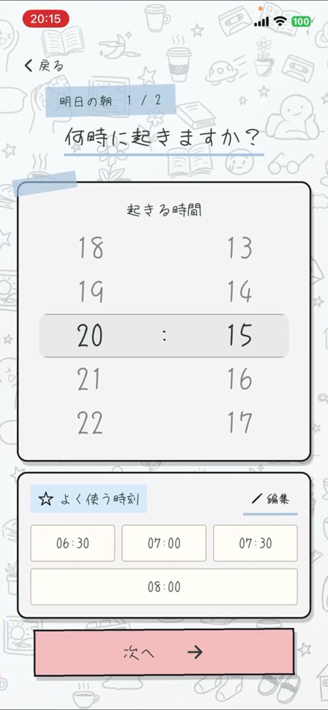
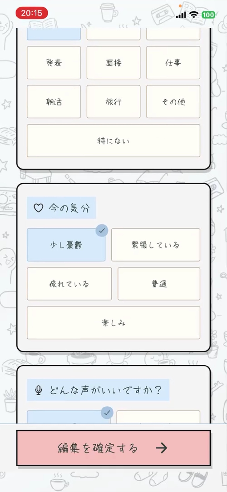
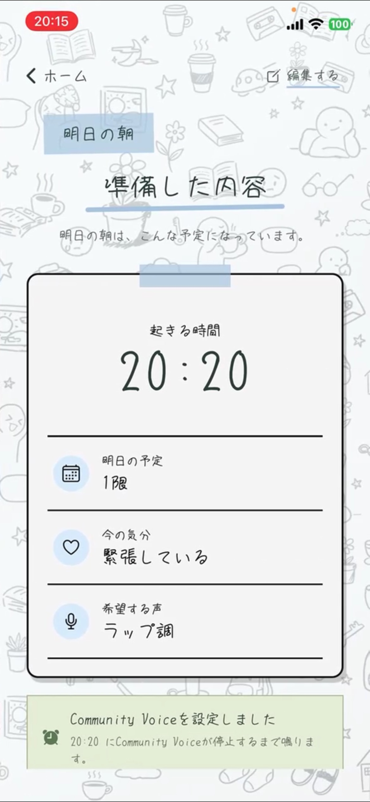
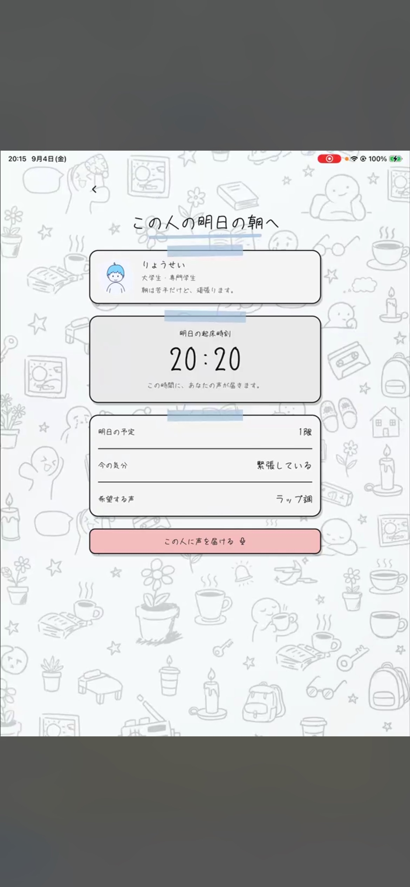
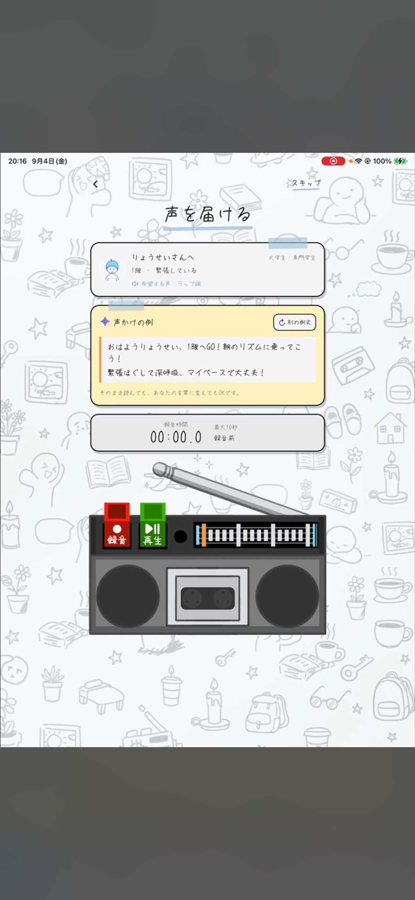
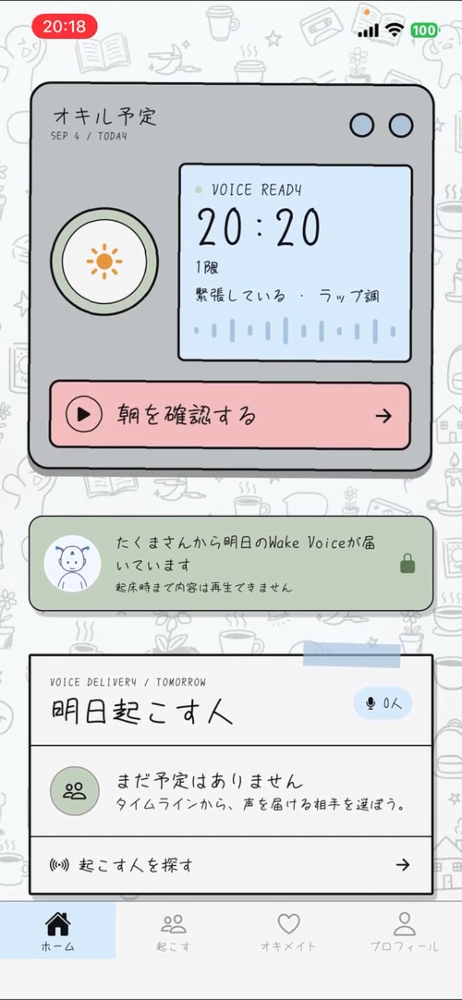

# オキタ！（Okita!）

**明日の朝を、誰かの声で。**

オキタ！は、人が録音した「おはよう」を目覚ましにできるアプリです。
明日の予定や気持ちを伝えておくと、誰かがあなたの朝に声を届けてくれます。
あなたも誰かに声を送り、起きたら「ありがとう」を返す。朝だけの、小さな助け合いをつくります。

## 使い方 — 夜の準備から、朝の「ありがとう」まで

**朝を登録 → 誰かに声を届ける → 自分に届いた声を確認 → 人の声で起きる → お礼を返す**

初回はプロフィールを設定します。以下は、起こされる人を **A**、Aに声を届ける人を **B** とした流れです。
自分が声を送る相手と、自分を起こしてくれる相手は、同じでなくても構いません。

### 1. A：明日の朝を登録する

起きたい時刻に加え、明日の予定・今の気持ち・希望する声を選びます。
「1限があって緊張している」「そっと優しく」「ラップ調」など、どんな朝にしたいかを伝えられます。

<table>
  <tr>
    <th width="33%">① 起きる時間を決める</th>
    <th width="33%">② 予定・気持ち・声を選ぶ</th>
    <th width="33%">③ 準備した内容を確認する</th>
  </tr>
  <tr>
    <td valign="top"></td>
    <td valign="top"></td>
    <td valign="top"></td>
  </tr>
</table>

最初は **Community Voice（みんな向けの声）** を準備します。自分宛てのPersonal Voiceが届き、端末への準備が完了すると、その声のアラームに切り替わります。

### 2. B：起こしたい人を選び、声を届ける

「起こす」からAの朝リクエストを開き、予定や気持ちを見て声をかけます。
ラジカセの **「録音」→「再生」で確認 →「この声を届ける」** で送信できます（2〜10秒）。

何を話すか迷ったときは、AIが予定・気持ち・希望する声に合わせた「声かけの例」を提案します。
そのまま読んでも、自分の言葉に変えてもOK。**アラームになるのはAIの読み上げではなく、B自身が録音した声です。**

<table>
  <tr>
    <th width="50%">④ 相手の明日の朝を知る</th>
    <th width="50%">⑤ 自分の声を録音する</th>
  </tr>
  <tr>
    <td align="center" valign="top"></td>
    <td align="center" valign="top"></td>
  </tr>
</table>

### 3. A：声が届く。内容は朝のお楽しみ

声が届いたら、ホームに **「○○さんから明日のWake Voiceが届いています」** と、送り主の名前・アイコンが表示されます。
**起床前には内容を再生できません。何を話してくれたかは、朝のお楽しみです。**

<p align="center">
  
</p>

### 4. A：指定時刻に、人の声で起きる

朝になると、**iPhoneをロックしたままでも、AlarmKitが端末に保存済みの声をアラームとして鳴らします。**
アプリ内の再生ボタンを押す必要はありません。

Personal Voiceが準備できていない場合はCommunity Voiceを使い、音声の準備に失敗した場合も標準アラームを保険として残します。

アラームを止め、必要に応じてロックを解除すると、アプリの **「起きた証明」** へ。
ミッションをこなして、二度寝せず朝を始めるきっかけをつくります。

*アラーム発火・起きた証明の画面写真は未掲載です。上の写真は準備・送受信の操作画面です。写真内の20時台は動作確認用の設定で、朝の時刻にも設定できます。*

### 5. A → B：「ありがとう」を返す

起床後は、起こしてくれた相手にお礼のボイスメッセージを送れます。
声を届けた側は **「帰ってきたボイメ」** で再生できます。
また起こし合いたい相手とは、**オキメイト** としてつながれます。

## できること

| 機能 | どんな体験？ |
| --- | --- |
| 朝リクエスト | 起床時刻・予定・気持ち・希望する声を伝え、誰かに朝を応援してもらう |
| Personal Voice | 自分のために録音された声で起きる。内容は朝までお楽しみ |
| Community Voice | みんな向けの録音を共有。Personal Voiceがない朝も、人の声を用意する |
| 声かけの例 | AIが相手に合わせた例文を提案。「何を話そう？」を助ける |
| 実機アラーム | iOSのAlarmKitで、保存済み音声を指定時刻に再生する |
| 起きた証明 | 起床ミッションで、アラームを止めたあとも体や頭を動かす |
| お礼のボイメ | 起こしてくれた相手に感謝を返し、受け取った側は声を聴ける |
| プロフィール・オキメイト | どんな人かを知り、また起こし合いたい相手とつながる |

## 開発背景・チーム

**Tornado2026に参加した、6人チームのプロダクトです。**

Tornado2026は、学生が役割を分担し、約3週間で企画・開発・発表に取り組むハイブリッド型ハッカソンです。開催期間は2026年8月17日〜9月5日。[イベント公式サイト](https://2026.tornado-official.jp/)

私たちは **PM 1人・デザイナー 1人・エンジニア 4人** で開発しました。
一人で迎えがちな朝を、誰かの声で支え合う体験に変えることを目指しています。

## 仕組み

録音した声はSupabaseに保存し、受け取る人の端末でアラーム用ファイルに準備します。

```text
Bが録音・送信
  → Supabase Storageに音声／Databaseに宛先・朝リクエストを保存
  → Aがアプリを開いて取得
  → iPhoneのLibrary/Soundsに保存・AlarmKitの音声を差し替え
  → 指定時刻に、ロック中でも保存済みの声でアラーム
```

| 担当する部分 | 使用技術 |
| --- | --- |
| 画面・ナビゲーション | Expo SDK 54 / React Native / Expo Router / TypeScript |
| アプリの状態管理 | Zustand |
| 認証・ユーザー間のデータ連携 | Supabase Auth / PostgreSQL |
| 録音ファイルの保存・配送 | Supabase Storage / 期限付きURL |
| 録音・アプリ内再生 | expo-audio |
| iOSの実アラーム | Swift製の独自Expo Module / AlarmKit |
| AIによる声かけ例 | Supabase Edge Functions |

## 開発・動作確認

### 画面や音声送受信を試す

```bash
npm ci
```

`.env` に自分たちのSupabaseプロジェクトの接続情報を設定します。

```dotenv
EXPO_PUBLIC_SUPABASE_URL=https://YOUR_PROJECT.supabase.co
EXPO_PUBLIC_SUPABASE_PUBLISHABLE_KEY=YOUR_PUBLISHABLE_KEY
```

DB・Storage・認証の準備は [Supabaseセットアップ](supabase/README.md) を参照してください。
既存DBにSQLを適用する場合は、適用済みの内容を確認してください。`service_role`・Secret Key・AIのAPIキーをアプリ側の公開環境変数に入れないでください。

```bash
npx expo start --go
```

対応するExpo GoでQRコードを読み取ると、プロフィール・朝リクエスト・音声送受信などを確認できます。
**Expo GoとWebではiOSのAlarmKitは利用できません。実際にロック中のアラームを試す場合は、下記のネイティブビルドを使います。**

Webの起動：

```bash
npm run web
```

### iPhoneで人の声アラームを試す

Mac・Xcode・iOS 26以降の対応実機と、署名設定が必要です。実機のDeveloper Modeを有効にし、マイク・アラームの権限を許可してください。

```bash
npx expo run:ios --configuration Release --device
```

ReleaseビルドはJavaScriptをアプリに同梱するため、起動時に開発サーバー（Metro）への接続は不要です。
音声の送受信にはインターネット接続が必要です。

**2ユーザーで試す最短手順：**

1. Aで準備時間に余裕のある未来時刻（5分後など）を設定し、fallbackのアラーム設定を確認する。
2. BでAの朝リクエストを選び、2秒以上録音して送信する。
3. Aでアプリを開き直すか更新し、送り主の表示とPersonal Voiceのアラーム設定完了を確認する。
4. AのiPhoneをロックして待ち、指定時刻にBの声が鳴ることを確認する。
5. 停止・ロック解除後に「起きた証明」へ進み、お礼を送る。B側でお礼の声を再生する。

Personal Voiceを送らない場合のCommunity Voiceも、別途同じ手順で確認できます。
無料のApple Personal Teamでの実機開発を前提にしており、現在のiOS音声取得にAPNsは使っていません。無料署名には有効期限があり、期限が切れた場合は再ビルド・再インストールが必要です。

Androidのネイティブビルドは、Java・Android SDKとUSBデバッグを有効にした実機を用意して実行します。AlarmKitはApple向けのため、Androidのアラームは別のネイティブ実装です。

```bash
npx expo run:android --device
```

### 静的チェック・詳しい仕様

```bash
npm run typecheck
npm run lint
```

- [プロダクト仕様](docs/PRODUCT_SPEC.md)
- [実装仕様](docs/IMPLEMENTATION_SPEC.md)
- [Supabaseセットアップ](supabase/README.md)
- [Expo SDK 54の公式ドキュメント](https://docs.expo.dev/versions/v54.0.0/)

仕様書には初期プロトタイプ時点の構想も含まれます。現行の操作フローと実装をあわせて参照してください。
